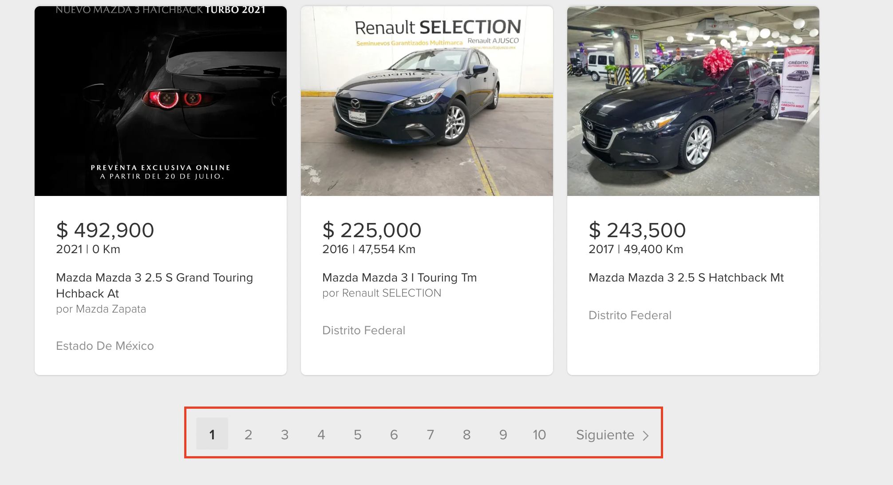
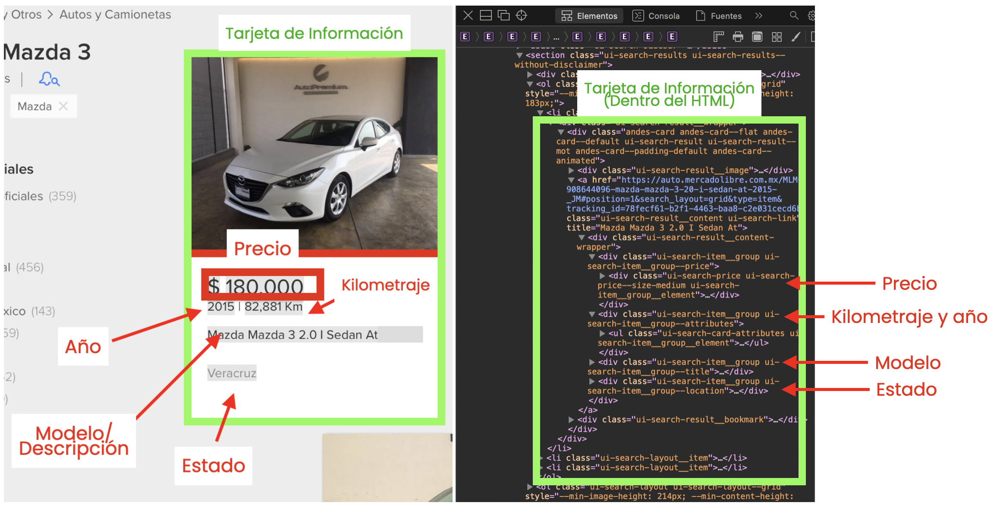

<style>

@import url('https://fonts.googleapis.com/css2?family=Poppins:wght@800&display=swap');
@import url('https://fonts.googleapis.com/css2?family=Poppins&display=swap');


  p {
    font-size:20px;
    font-family:Poppins;
  }
  
  h1,h2,h3 {
    color:#0b5239;
    font-family:Poppins-Bold;
    text-align:center;
  }
  
  .author_name{
    font-family:Poppins-Bold;
  }
  
  .author_bio{
    font-family:Poppins;
  }
  
  th{
    background-color:#e87758;
  }

  p.footnote{
  color:#5e5e5e;
  font-size:70%;
  }
  
</style>


```{r setup, include=FALSE}
knitr::opts_chunk$set(echo = TRUE)
```

En esta entrada vamos a ver como extraer datos de precios de vehículos de _mercadolibre.com_ . Este es un tutorial en el que vamos a comentar el código visto en clase y a ahondar más en el razonamiento detrás de cada uno de los pasos. 

### Paso #1. Definir el problema. 

> Supongamos que Jesús Diaz tiene el problema de que quiere comprarse un _Mazda 3_ usado y quiere comparar entre los distintos precios que hay en la plataforma de Mercado Libre para encontrar la mejor alternativa calidad/precio. 

Los datos que queremos obtener son los siguientes: 

* Año del modelo del vehículo. 

* Precio en MXN.

* Url de la página donde se vende.

* El estado donde esta puesto en venta

* Imágen o fotografía del vehículo. 

Lo que ahora procede es, entonces, ubicar las páginas en las cuales puede checar los precios. 

### Paso #2. Encontrar la página adecuada. 

Haciendo una búsqueda rápida, vemos que en la siguiente página se pueden consultar los precios de este vehículo:

https://autos.mercadolibre.com.mx/mazda/mazda-3/


<p class = "footnote">Fig. 1 Página donde se vende el vehículo de interés.</p>

> Cuando ubicamos la página que nos interesa, una de las cosas que tenemos que preguntarnos es... ¿la página es una página estática o su contenido cambia conforme a la respuesta del usuario? 

En el caso de que la página sea estática (**entendiendo como estática que cargue todo el contenido desde el inicio y que el contenido sea el mismo para todos los usuarios**), podemos proceder a realizar una extracción de datos utilizando lo visto en clase con el paquete `rvest`. 

Este es el caso de las páginas de _mercadolibre_.

```{r, cache = FALSE, message=FALSE}
# Librerias ----
options(scipen = 999) # Evitamos not. científica
library(tidyverse)    # Manejo de datos
library(rvest)        # Web Scraping
library(plotly)       # Visualizacion interactiva
```

> Tip: Cuando la página tenga un control de paginación (como vemos que tiene esta página) mi tip es que empezemos no desde la primera página guardada, sino desde la segunda, ya que a partir de esta la url empieza a tener un comportamiento uniforme. 


<p class = "footnote">Fig. 2 Control de paginación en la página de interés.</p>

Por ejemplo, a partir de la página 2, las urls de cada página se ven así: 

```
# "https://autos.mercadolibre.com.mx/mazda/mazda-3/_Desde_49",
# "https://autos.mercadolibre.com.mx/mazda/mazda-3/_Desde_97",
# "https://autos.mercadolibre.com.mx/mazda/mazda-3/_Desde_145",
# "https://autos.mercadolibre.com.mx/mazda/mazda-3/_Desde_193",
```

Y de aquí se ve que van cambiando de 48 en 48. Si escribimos entonces la siguiente url (restandole 48 a la url de la página 2) tenemos lo siguiente: 

```
# "https://autos.mercadolibre.com.mx/mazda/mazda-3/_Desde_1",
```

Que nos dá exactamente lo mismo que la primera página visitada.

Con esta información ya podemos generar un conjunto (vector de texto) de urls con la información que requiero; esto lo hacemos con el siguiente código: 

```{r}
# Generamos las urls de las páginas que contienen los precios
urls_ind = str_c("https://autos.mercadolibre.com.mx/mazda/mazda-3/_Desde_",
                 seq(49,
                     300,
                     by = 48))

# Imprimimos el objeto 
urls_ind
```

### Paso # 3. Hacemos el caso n = 1. 

Lo que ahora tenemos que hacer es extraer los datos de todos los vehículos disponibles. Para esto, tenemos que programar la extracción de la información de todas las páginas web que definimos arriba, a través de un proceso iterativo. 

Siempre que vamos a llevar a cabo un proceso de este tipo, es recomendable empezar con un primer caso (llamémosle, caso `n = 1`) para luego extender este proceso a `n = 2`, luego a `n = 3` y así sucesivamente (y ver si no truena la cosa en el camino).

En este caso, entonces, nuestro `n = 1` va a ser trabajar con la siguiente página: https://autos.mercadolibre.com.mx/mazda/mazda-3/_Desde_97

```{r}
# Página de interés ----
url = "https://autos.mercadolibre.com.mx/mazda/mazda-3/_Desde_97"
```

Una vez definida la página, seguimos el proceso que hemos visto en clase: 

1. Leemos el código de la página web, y lo guardamos en un objeto llamado `página`. 

```{r}
pagina <- read_html(url)
```

2. Ubicamos, dentro de la página, la información que vamos a necesitar. 



<p class = "footnote">Fig. 3 Información necesaria y su ubicación dentro del código de la página.</p>

Como podemos ver, en este caso la información se organiza dentro de tarjetas. La estrategia que vamos a seguir es leer la información de todas las tarjetas y navegar entre todos estos datos. 

> **Ojo**. Recuerda que para ver el código de cierta parte de la página, hay que marcar esta parte de interés, y luego darle click derecho y entrar al inspector. De esta manera, cuando se muestre el código de la página, la parte resaltada en la página aparece igualmente resaltada en el código. 

3. Extraemos los datos de las tarjetas. 

Para esto, ubicamos el código de las tarjetas, y con la función `html_nodes` extraemos, del código total de la página, solo el código de las tarjetas. 

```{r}
# Guardamos solo el código de las tarjetas.
tarjetas <- pagina %>% 
  html_nodes(".andes-card")

# Imprimimos el código de las tarjetas
head(tarjetas, 3)

```
4. Ahora que tenemos el código de las tarjetas, ya extraemos los componentes que contienen los datos que nos interesan, de manera individual. 

**Algunas precisiones**

1. Recordemos, de lo visto en clase, que cuando queremos extraer datos de un tag a partir de su clase, tenemos que escribir primero un punto `"."` y luego el nombre de la clase. Si quieres extraer todo el contenido del `tag html`, no se requiere incluir el punto. 

2. ¿Qué nombre incluímos dentro del Nodo? Generalmente, solo se incluye el primer nombre de la clase hasta llegar al primer espacio (sin incluirlo). Aunque a veces se llega a utilizar el segundo o el tercero, dependiendo cual identifique el elemento que queremos extraer de manera más particular. 
3. Se recomienda que, para que compruebe de donde salió cada cosa, vaya revisando e inspeccionando la página paso por paso. 

* **Modelo o descripción**

En este caso, vamos a extraer el título 2 (`h2`) que se encuentra dentro de la tarjeta.

```{r}
# Extraemos la descripción
descripcion <-  tarjetas %>% 
  html_nodes("h2") %>% 
  html_text()

# Imprimimos los primeros 6 renglones 
head(tarjetas)

```

* **Precio en MXN.**

En este caso vamos a extraer el tag `span` identificado por la clase `.ui-search-price` de todas las tarjetas. 

```{r}

# Extraemos el precio como texto del código de las tarjetas
precio <- tarjetas %>% 
  html_nodes(".ui-search-price") %>% 
  html_text()

# Convertimos el precio a numero, utilizando stringr. 
precio <- precio %>% 
  str_remove(pattern = "\\$") %>% # Escapamos el simbolo de $ y lo quitamos
  str_remove(pattern = ",") %>%  # Quitamos las comas
  as.numeric() # Convertimos a numero

# Imprimimos y checamos 
head(precio)

```

* **Año del modelo del vehículo y el kilometraje**

Acá vamos a extraer el tag `span` identificado por la clase `.ui-search-price` de todas las tarjetas. 

```{r}

# Extraemos el año del modelo 
atributos <- tarjetas %>% 
  html_nodes(".ui-search-card-attributes") %>% 
  html_nodes(".ui-search-card-attributes__attribute") %>% 
  html_text()

#### EXTRAEMOS LOS KILOMETRAJES

# Generamos un vector de TRUEs para cada elemento en el que 
# aparece la palabra "Km"
hay_kilometraje = str_detect(atributos, pattern = "Km")

# Filtramos los atributos que cumplen con que haya la palabra Km
kilometraje <- atributos[hay_kilometraje] 

# Le quitamos la palabra Km, la coma y lo volvemos numero
kilometraje <- kilometraje %>% 
  str_remove(pattern = " Km") %>% # Ojo con el espacio!!!!!!
  str_remove(pattern = ",") %>%  # Quitamos las comas
  as.numeric() # Convertimos a numero
  
### EXTRAEMOS LOS AÑOS 

anios <- atributos[!hay_kilometraje] # El simbolo "!" cambia 
# los TRUES a FALSES,
# por lo que ahora nos estamos quedando con los atributos que NO 
# incluyen la palaba "Km"

# Convertimos a numeros
anios = anios %>% 
  as.numeric()

```

* **Url de la página donde se vende.**

```{r}
# Extraemos las urls ----
urls = tarjetas %>% 
  html_nodes(".ui-search-result__content") %>% 
  html_attr("href") # Extraemos el atributo href del tag "a"

# Imprimimos las urls
head(urls)
```

* **El estado donde esta puesto en venta**

```{r}
# Extraemos los nombres de los lugares. 
lugares = tarjetas %>% 
  html_nodes(".ui-search-item__location") %>% 
  html_text()

# Imprimimos los primeros 6 lugares.
head(lugares)

```

* **Imágen o fotografía del vehículo. **

```{r}

# Jalamos el tag imagen del codigo de las tarjetas
imagenes = tarjetas %>% 
  html_nodes("img") 

# Imprimimos como texto para explorar
imagenes %>% as.character() %>% pluck(1)

# De acá, vemos que el atributo que queremos es el atributo "data-src"
# y lo extraemos 

imagenes <- imagenes %>% 
  html_attr("data-src") # Este atributo lo cheque 

# Imprimimos la dirección de las primeras 6 imagenes
head(imagenes)

```
* **Armamos la tabla n = 1**.

Ahora que ya lo tenemos todo, armamos el tibble del caso `n = 1`: 

```{r}
# Creamos la tabla con los datos de la página
datos_pagina <- tibble(
  descripcion,
  precio, 
  kilometraje, 
  anios,
  urls,
  lugares,
  imagenes
)

# Imprimimos el caso n = 1
head(datos_pagina)

```

### Paso 4. Ejecutamos el proceso interativo con las demás páginas. 

Una vez que ya armamos el proceso `n = 1`, lo ejecutamos, a través de un loop, a las demás páginas. 

<p style = 'text-align: center;'>

<p>

<p class = "footnote">Fig. 4 Diagrama de un `for` loop.</p>

Para llevar eso a cabo, primero generamos un `tibble` vacío para irlo llenando con cada paso del bucle. 

```{r}
tibble_vacio = tibble()
```

Y después, metemos TOOOOODO el proceso anterior dentro de un bucle. 

> **Ojo. ** Checa que en el último paso, le metemos la tabla creada del loop a la tabla en blanco que generamos arriba. 

```{r}

# Recordemos que todas las páginas que vamos a visitar se guardaron 
# en el objeto "urls_ind"

#### Creamos el for loop. 
# Recordemos que vamos a ir visitando todas las páginas 
# guardadas en el objeto "urls_ind". 

# El elemento que va a ir variando se va a llamar "url"
# y, en cada paso del loop, va a ir tomando cada uno de los 
# valores guardados en el objeto "urls_ind"

# Bucle for
for(url in urls_ind){
  # Guardamos el codigo de la pagina
  pagina <- read_html(url)
  # Guardamos el codigo de las tarjetas
  tarjetas <- pagina %>% 
    html_nodes(".andes-card")
  # Guardamos la descripcion del vehiculo
  descripcion <-  tarjetas %>% 
    html_nodes("h2") %>% 
    html_text()
  #Guardamos el precio
  precio <- tarjetas %>% 
    html_nodes(".ui-search-price") %>% 
    html_text() %>% 
    str_remove(pattern = "\\$") %>% 
    str_remove(pattern = ",") %>%  
    as.numeric() 
  # Guardamos el año y el kilometraje
  atributos <- tarjetas %>% 
    html_nodes(".ui-search-card-attributes") %>% 
    html_nodes(".ui-search-card-attributes__attribute") %>% 
    html_text()

  hay_kilometraje = str_detect(atributos, 
                               pattern = "Km")
  kilometraje <- atributos[hay_kilometraje] 

  kilometraje <- kilometraje %>% 
    str_remove(pattern = " Km") %>%
    str_remove(pattern = ",") %>%  
    as.numeric() 

  anios <- atributos[!hay_kilometraje] 
  anios = anios %>% 
    as.numeric()
  #Urls de las paginas individuales
  urls = tarjetas %>% 
    html_nodes(".ui-search-result__content") %>% 
    html_attr("href")
  # Estado donde se vende 
  lugares = tarjetas %>% 
    html_nodes(".ui-search-item__location") %>% 
    html_text()
  # Jalamos las imagenes
  imagenes <- tarjetas %>% 
    html_nodes("img") %>% 
    html_attr("data-src")
  # Generamos la tabla de la página 
  datos_pagina <- tibble(
      descripcion,
      precio, 
      kilometraje, 
      anios,
      urls,
      lugares,
      imagenes)
  
  # Lo guardamos todo en la gran tabla final 
  tibble_vacio <- rbind(tibble_vacio, datos_pagina)
}

```

Después de ejecutar el ciclo anterior, el objeto `tibble vacío` ya tiene todos los datos que nos interesan, y ya solo resta hacer análisis. 

```{r}

# renombramos el objeto ---
datos <- tibble_vacio

# Visualizamos los datos ----
library(DT)
DT::datatable(datos,
                  escape = FALSE,
                  extensions = 'FixedColumns',
                  rownames= FALSE,
                  filter = 'top',
                  options = list(
                    # pageLength = 5,
                    language = list(url = '//cdn.datatables.net/plug-ins/1.10.11/i18n/Spanish.json'
                    ),
                    placeHolder = "hola",
                    autoWidth = TRUE, 
                    scrollX = TRUE,
                    escape = T))

# Le generamos una nueva columna con todo el texto pegado. 
datos <- datos %>% 
  mutate(label = str_c(
    # "", "<br>",
    "<b>Descripción: </b>", descripcion, "<br>", 
    "<b>Precio: </b> $", prettyNum(precio, big.mark = ",") , "<br>",
    "<b>Kilometraje: </b> ", prettyNum(precio, big.mark = ",") , " km<br>", 
    "<b>Modelo: </b> ", anios , "<br>")) 

# Hacemos una gráfica de dispersión kilometraje vs precio 
plt <-  datos %>% 
  ggplot(aes(x = kilometraje, 
             y = precio, 
             text = label)) + 
  geom_point(pch = 21, fill = "white", color = "salmon") + 
  scale_x_continuous(labels = scales::dollar_format()) + 
  scale_y_continuous(labels = scales::comma_format()) + 
  labs(x = "Kilometraje", y = "Precio", title = "Precios de Mazda 3 en México\nVehículos vendidos en mercadolibre.com\nRelación kilometraje contra precio", 
       subtitle = "Relación kilometraje contra precio") + 
  theme_minimal() + 
  theme(plot.title = element_text(hjust = 0.5))

# Versión interactiva
ggplotly(plt, tooltip = "text")

# Hacemos una gráfica de dispersión antiguedad vs precio 
plt <-  datos %>% 
  mutate(antiguedad = 2021 - anios) %>% 
  ggplot(aes(x = as.factor(antiguedad), 
             y = precio, 
             text = label)) + 
  geom_point(pch = 21, fill = "white", color = "salmon") + 
  scale_y_continuous(labels = scales::dollar_format()) + 
  labs(x = "Antiguedad (años)", y = "Precio", title = "Precios de Mazda 3 en México\nVehículos vendidos en mercadolibre.com\nRelación antiguedad contra precio", 
       subtitle = "Relación antiguedad contra precio") + 
  theme_minimal() + 
  theme(plot.title = element_text(hjust = 0.5))

# Versión interactiva
ggplotly(plt, tooltip = "text")

```

De las gráficas anteriores se observan varias cosas: 

* La relación negativa entre kilometraje y precio y entre antiguedad y precio.

* Que hay coches 2021 más baratos que muchos 2020, y así para todos los años. 

* El coche más caro cuesta \$532,000 y el más barato está en \$60,000. 

* El coche más antiguo es modelo 2006, y es precisamente el más barato. 

**Ahora, contesta las siguientes preguntas: **

- ¿Qué coche debería comprarse Jesús? ¿Por qué? 

- Si Jesús ya no quisiera un Mazda-3, sino que ahora quiere checar los Prius... ¿Qué tendría que cambiar en el código? 


**Conclusiones: **

El Web Scraping de páginas web estáticas es una herramienta muy importante del proceso de extracción de información, y nos permite acceder a grandes cantidades de información de manera rápida y eficiente. 

Siempre que se va a echar mano de estos métodos de extracción automatizada, es importante tener bien claro el objetivo del análisis final y entender bien todos los pasos que se tienen que llevar a cabo para conseguir la información deseada; lo demás es cuestión de repetir y practicar el proceso. Obviamente, también hay que tratar de no meterse en problemas extrayendo información delicada.

**Alcances: **

El presente tutorial se hizo pensado en los alumnos del curso de _Periodismo de Datos_ del CIDE, por lo que hace uso de los conceptos vistos en clase hasta la presente fecha. Si quieres revisar como hacer algo similar a lo del presente tutorial, pero utilizando funciones `lapply()`, puedes ver este otro [trabajo.](https://github.com/JuveCampos/30DayChartChallenge2021/blob/main/Day%2013.%20Correlation/code_13.R)


