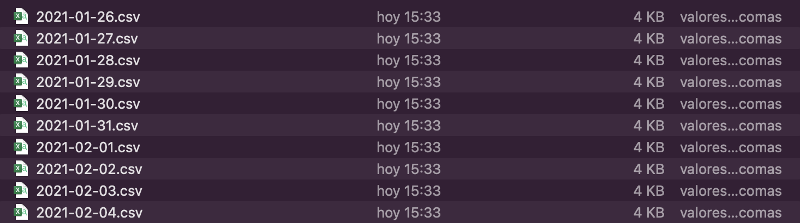

```{r setup, include=FALSE}
knitr::opts_chunk$set(echo = TRUE, message = FALSE, warning = FALSE)
```

En esta tarea, practicaremos la sección del curso dedicada a la obtención de bases de datos. 

* **Forma de entrega: ** Carpeta comprimida a mi correo. 

# Ejercicio 1. Datos abiertos. 

El archivo `"01_Datos/2021.csv"` de la presente carpeta contiene los enlaces de descarga de los reportes diarios de la [cantidad suministrada de energía](https://www.cenace.gob.mx/Paginas/SIM/Reportes/H_CantidadesAsignadasMDA.aspx?N=61&opc=divCssCantAsig&site=Cantidades%20asignadas/MDA/Por%20Participante%20del%20Mercado&tipoArch=C&tipoUni=SIN&tipo=Por%20Participante%20del%20Mercado&nombrenodop=MDA) por los [participantes del mercado de energía](https://www.cenace.gob.mx/Paginas/SIM/ParticipantesMEM.aspx) de la CENACE para los primeros días del 2021. 

Para el presente ejercicio, descargue los archivos diarios de la energía asignada por participante/hora del día y guardelos en la carpeta "01_Datos/Descargas", siguiendo los siguientes pasos: 

1) Explique, comentando cada linea de código, lo que hace cada una de las instrucciones del siguiente chunk. Se vale googlear o utilizar la ayuda.

```{r}
# Librerias
library(tidyverse)
library(curl)
library(rebus)

# limpieza de los datos ----
links <- readr::read_csv("01_Datos/2021.csv") %>% 
  select(-X1) %>% 
  slice(18:2229) %>% 
  mutate(fecha = str_extract(destinos, 
                             pattern = rebus::repeated(DGT, 4) %R%
                               "-" %R% one_or_more(DGT) %R% "-" %R% 
                               repeated(DGT,2))) %>% 
  unique()

```

2) Realice la descarga de todos los archivos que se encuentran en la columna `destinos` del objeto `links` creado en el paso anterior, utilizando un bucle `for`. Guarde cada uno de los archivos en la carpeta `"01_Datos/descargas"` y nombre cada archivo en función de la columna `fecha` creada en el paso anterior. 

Se tiene que ver algo así en esa carpeta: 


<!--  -->


# Ejercicio 2. APIs. 

La aplicación `bitso` es una aplicación para comprar `criptomonedas` en México, y provee al público en general de un API pública para consultar datos de movimientos de estos "activos" en el país. 

Realice lo siguiente: 

1) Diríjase a la dirección https://bitso.com/api_info?l=es#public-rest-api y explique cuales son las 4 consultas que se pueden hacer al API pública de Bitso. Esta página presenta la documentación de la API y recuerde que revisar la documentación es el primer paso para empezar a consumir este tipo de servicios. 


2) Realice una consulta al API de bitso para conocer cuales son los 25 libros disponibles (como `"btc_mxn"` o `"eth_btc"`).


3) Hay consultas a APIs que requieren de parámetros de consulta para poder devolvernos información. En el caso de esta API, el parámetro que requieren las consultas "Ticker", "Order Book" o "Trades" es el parámetro "book". 
Para solicitar, por ejemplo, información sobre un libro en específico a través de la consulta "Ticker", tendríamos que hacer la siguiente consulta: 

```{r}
# Librerías (usted tuvo que cargarlas desde el ejercicio anterior)
library(httr)
library(jsonlite)

info_book <-
  GET("https://api.bitso.com/v3/ticker/", 
# Esta es la parte nueva    
    query = list(book = "btc_mxn")) %>% 
  content("text") %>% 
  fromJSON(flatten = TRUE)

# Volumen de transaccion de las ultimas 24 horas: 
# Navegamos en la lista para obtener el valor deseado.
info_book$payload$volume

# Precio de transacción mínimo de las ultimas 24 horas, en pesos: 
info_book$payload$low

# Precio de transacción mínimo de las ultimas 24 horas, en pesos: 
info_book$payload$high

# Orden de venta más bajo, en pesos
info_book$payload$ask

#Y así...

```

A partir de este ejemplo previo, **obtenga las transacciones hechas para el libro `btc_mxn` a través de una solicitud hecha con la sintaxis de `"Trades"`**.

```{r, echo = FALSE, eval = FALSE}

transacciones <-
  GET("https://api.bitso.com/v3/trades/", 
# Esta es la parte nueva    
    query = list(book = "btc_mxn", 
                 limit = 100, 
                 sort = "desc")) %>% 
  content("text") %>% 
  fromJSON(flatten = TRUE)

transacciones$payload


```


# Ejercicio 3. Cliente API. 

Con lo visto en clase, elabore una nube de palabras de un tema en tendencia en Twitter México.

# Ejercicio 4. Web Scraping. 

A partir de la página del [Taller de datos de Nexos](https://datos.nexos.com.mx) y con lo visto en el [ejemplo de vehículos de mercadolibre.com](https://rpubs.com/Juve_Campos/scrapVehiculosMercadoLibre), genere una base de datos que contenga la siguiente información para los más de 118 artículos publicados hasta la fecha: 

* **Título de cada artículo.**

* **Autor o autores del artículo** 

* **Párrafo introductorio de cada artículo** 

* **Enlace cada artículo**

* **Fecha de publicación (en texto) de cada artículo** (si confías en tus habilidades de `stringr`, puedes intentar generar la fecha en formato `Date`).

Y guarda la tabla en un archivo en formato `*.csv` en la carpeta `01_Datos`.

